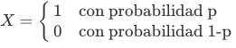

# Disribuciones estadisticas

## Distribuciones de probabilidad discretas

Son las distribuciones correspondientes a variables aleatorias que toman valores discretos, como por ejemplo los valores 0 y 1, las letras del abecedario, determinados colores, o los números 0,1,2,....

Ejemplos de ellas son:
* el número de caras en 100 tiradas de una moneda,
* el número de siniestros mensual en una compañía de seguros o
* el número de apariciones de las palabras viagra u oferta en un correo electrónico.

### Distribucion de Dirac

La distribución de Dirac puede considerarse degenerada: toma siempre (con probabilidad 1) un valor fijo a. Una variable aleatoria de Dirac, por lo tanto, no es aleatoria. Aunque parezca contraintuitivo, la distribución de Dirac tiene su importancia y puede entenderse de dos maneras. La primera, como el elemento básico a partir del cuál se pueden construir otras distribuciones discretas.
La segunda, como una distribución límite. Por ejemplo, el número de goles que se van a marcar en un partido de fútbol es una variable aleatoria cuya incertidumbre se reduce según corren los minutos y su distribución se convierte en una de Dirac apenas finaliza el encuentro. De hecho, lo mismo sucede en todos los eventos sobre los que las casas de apuestas aceptan pujas en tiempo real.

### Distribucion de Bernoulli

La distribución de Bernoulli es muy simple: es la de una moneda con probabilidad P(H) = p de cara. Una variable aleatoria de Bernoulli toma valores 0 o 1 (que frecuentemente se usan para codificar otros tales como cara o cruz, éxito o fracaso, etc.). Si X ∼Bernoulli(p), entonces

  

Puede considerarse una mezcla de dos distribuciones de Dirac. A la inversa, la distribución de Dirac es un caso degenerado de la de Bernoulli que ocurre cuando 
p = 0 o p = 1.
La distribución de Bernoulli es la base de muchos modelos de clasificación. De hecho, una de las tareas más habituales de la ciencia de datos es encontrar el valor pi asociado a una determinada acción (de resultado binario) de un sujeto i.

### La media de una variable aleatoria

Una variable aleatoria es un objeto extraño en el sentido de que puede tomar distintos valores de una manera impredecible: piénsese en un dado. La teoría de la probabilidad, sin embargo, es capaz de identificar (y estudiar) regularidades dentro de ese azar. Por ejemplo, si varias personas realizan —esta realización puede ser efectiva (p.e., tirando una moneda o, más en general, realizando un experimento) o simulada (p.e., usando un ordenador)— una variable aleatoria numérica X muchas veces y promedian los valores resultantes, obtendrán una lista de números muy parecidos.

### Distribución binomial

La distribución binomial es la de una suma de variables aleatorias de Bernoulli independientes. Permite modelar problemas como el número de caras que se obtienen después de tirar una moneda 15 veces. O el número de clientes que abandonaran la empresa al cabo de un año si la correspondiente tasa de fuga es del 12%.

Por ser una suma de variables aleatorias de Bernoulli, podemos deducir su media: es np. Pero, además de su media, interesa saber cómo se distribuyen los valores alrededor de ese valor. Para ello podemos representar gráficamente su función de probabilidad, que tiene una típica forma de campana (es unimodal) y es ligeramente asimétrica (es simétrica sólo cuando p = 0.5):

  

### Centralidad y dispersión

La gráfica de la sección anterior muestra cómo se distribuye la probabilidad de la distribución binomial: se trata de una especie de campana más o menos simétrica situada sobre cierto punto central característico y de una anchura determinada. Patrones similares se observan también en otras distribuciones de probabilidad habituales (aunque no siempre) y ese es el motivo fundamental para estudiar los indicadores de centralidad y dispersión: nos ayudan a describir este tipo de distribuciones. Al decir este tipo de distribuciones se pretende subrayar que esos indicadores son problemáticos a la hora de estudiar otro tipo de distribuciones que no presenten esas características.

La media admite entonces una interpretación como una medida de centralidad: es un valor alrededor del cual podría decirse que pivota la distribución. De hecho, para la distribución binomial es precisamente el valor central. Sin embargo, no es necesariamente un valor típico: pudiera ser, incluso, un valor imposible para la distribución. Eso ocurre precisamente con la distribución de Bernoulli: su media es p, un valor típicamente estrictamente comprendido entre 0 y 1, mientras la variable solo puede tomar los valores 0 o 1.

Una manera alternativa de entender la centralidad es la de interpretarla como el valor que está estrictamente en la mitad. Es decir, aquel que tiene el 50% de las observaciones por encima y el 50% de ellas por debajo, la mediana. Y si por centralidad, abusando del lenguaje, se entiende un valor típico, otra medida alternativa que se usa (menos frecuentemente) es el de la moda, el valor más frecuente. El concepto que complementa al de la centralidad a la hora de describir la forma de una variable aleatoria como las binomiales es de la dispersión: la medida en que los valores de la distribución están cerca o lejos de su punto medio (calculado por el procedimiento que sea). La varianza es un indicador tradicionalmente usado para cuantificar la dispersión.

   
