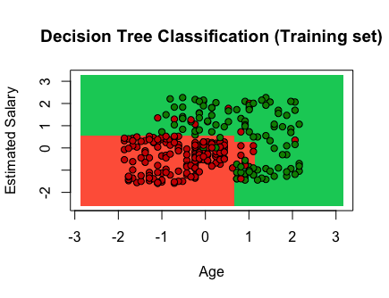

## Practice 3 Desicion tree

#### We load the data from the dataframe in a variable to execute its values and give it the corresponding view and it will take those that we will need in reference to its columns.
```R
dataset = read.csv(file.choose())
dataset = dataset[3:5]
```

#### We perform the transformation of data to factor the column assigning binary values to facilitate the handling of the data.
```R
dataset$Purchased = factor(dataset$Purchased, levels = c(0, 1))
```

#### We import the caTools library, assign the seed, create our split where we will take the Purchased data, assigning 75% of the data to training and 25% to testing.
#### install.packages('caTools')
```R
library(caTools)
set.seed(123)
split = sample.split(dataset$Purchased, SplitRatio = 0.75)
training_set = subset(dataset, split == TRUE)
test_set = subset(dataset, split == FALSE)
```

#### We scale the values that are not the assigned range in the data set
```R
training_set[-3] = scale(training_set[-3])
test_set[-3] = scale(test_set[-3])
```

#### We import the rpart library that will help us to see the behavior of the grouping of lines by the tree model, we create our variable for the model and we tell it what we want to predict within it and the data of where that is going.
#### install.packages('rpart')
```R
library(rpart)
classifier = rpart(formula = Purchased ~ .,
                   data = training_set)
```

#### We predicted the results of the whole test.
```R
y_pred = predict(classifier, newdata = test_set[-3], type = 'class')
y_pred
```

#### A confusion matrix is created to determine the quantity that is percent stable and those that are not. To determine a result thanks to this method.
```R
cm = table(test_set[, 3], y_pred)
cm
```

#### We visualize the training data, incorporating the ElemStatLearn library.
```R
library(ElemStatLearn)
set = training_set
X1 = seq(min(set[, 1]) - 1, max(set[, 1]) + 1, by = 0.01)
X2 = seq(min(set[, 2]) - 1, max(set[, 2]) + 1, by = 0.01)
grid_set = expand.grid(X1, X2)
colnames(grid_set) = c('Age', 'EstimatedSalary')
y_grid = predict(classifier, newdata = grid_set, type = 'class')
plot(set[, -3],
     main = 'Decision Tree Classification (Training set)',
     xlab = 'Age', ylab = 'Estimated Salary',
     xlim = range(X1), ylim = range(X2))
contour(X1, X2, matrix(as.numeric(y_grid), length(X1), length(X2)), add = TRUE)
points(grid_set, pch = '.', col = ifelse(y_grid == 1, 'springgreen3', 'tomato'))
points(set, pch = 21, bg = ifelse(set[, 3] == 1, 'green4', 'red3'))
```

|||
|||

#### We will observe the results thanks to the test, giving the structure to the graph with stable determinations for its visualization. We import ElemStatLear to show the grouping by model trees, we assign set the test data, then we assign the values for our groups marking the min and max, we assign the columns of which we want to make the decision, we add the prediction and then we make the plot of these data, we give the plot the columns of the set that we want it to take, the dividing line created by contour and the last point what it does is that it colors the points according to the set to assign them the color they should have according to your prediction.
```R
library(ElemStatLearn)
set = test_set
X1 = seq(min(set[, 1]) - 1, max(set[, 1]) + 1, by = 0.01)
X2 = seq(min(set[, 2]) - 1, max(set[, 2]) + 1, by = 0.01)
grid_set = expand.grid(X1, X2)
colnames(grid_set) = c('Age', 'EstimatedSalary')
y_grid = predict(classifier, newdata = grid_set, type = 'class')
plot(set[, -3], main = 'Decision Tree Classification (Test set)',
     xlab = 'Age', ylab = 'Estimated Salary',
     xlim = range(X1), ylim = range(X2))
contour(X1, X2, matrix(as.numeric(y_grid), length(X1), length(X2)), add = TRUE)
points(grid_set, pch = '.', col = ifelse(y_grid == 1, 'springgreen3', 'tomato'))
points(set, pch = 21, bg = ifelse(set[, 3] == 1, 'green4', 'red3'))
```
|||
|||

#### These two lines show the decisions made by the tree to perform the grouping taking into account our classifier variable that contains the model and the training data.
```R
plot(classifier)
text(classifier, cex=0.6)
```


#### Conclution
Visualize data if it is necessary to group and see the flow of decisions made by the tree so that it can perform automatic groupings and in this case a few parameters were needed to the structure of the decision tree model to arrive at the estimated price that can be analyzed for draw our conclusions.

